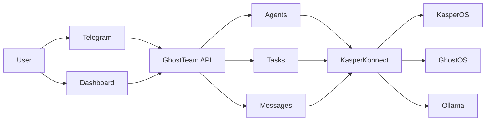

# GhostTeam

GhostTeam is built by GodsIMiJ AI Solutions Inc. and architected by James D. Ingersoll.

License: [Apache-2.0](LICENSE)

GhostTeam is a local-first multi-agent coordination runtime for orchestrating AI agents, task handoffs, message routing, and operational memory across the GodsIMiJ/KasperOS ecosystem.

It acts as a coordination kernel: a small Rust control plane that keeps state on disk, lets agents join under a role and backend, routes messages between agents, and tracks task handoffs through a simple command-line interface.

It can also mirror agents, messages, and task handoffs into KasperKonnect automatically when the daemon is running locally, or explicitly when you set `GHOSTTEAM_KASPERKONNECT_URL=http://127.0.0.1:4077`.

It also ships with a dedicated dashboard that opens at `/` when the API server is running.

## System Diagram



## Overview

GhostTeam is built around three core ideas:

- `agents` register themselves with a role and model backend
- `messages` provide agent-to-agent communication
- `tasks` track work items, acknowledgements, completions, and history

The workspace lives in `.ghostteam/`, which holds:

- `ghostteam.db` for SQLite state
- `roles/` for role prompt files
- `teams/` for team definitions

## Quickstart in 60 Seconds

```bash
git clone https://github.com/GodsIMiJ1/GhostTeam
cd GhostTeam/ghostteam
cargo build
ghostteam init
ghostteam join manager --role manager --backend ollama
```

If you want the API and dashboard too, start the server after initialization:

```bash
ghostteam --api
```

## Installation

### Prerequisites

- Rust toolchain
- `cargo`
- `tmux` for the launcher script
- Optional local model runtime:
  - Ollama
  - llama.cpp binary

### Build from source

From the repository root:

```bash
cd ghostteam
cargo build
```

If a local build leaves `target/` or cache files behind, restore the tree with `git restore target` and delete any `__pycache__` folders before committing.

### Release build

To build an optimized binary:

```bash
cargo build --release
```

### Install system-wide

You can install GhostTeam system-wide with either `make` or the helper script.

Using `make`:

```bash
make install
```

Using the install script:

```bash
./scripts/install.sh
```

Both flows build the release binary, copy it to `/usr/local/bin/ghostteam`, and create `~/.ghostteam` if it does not already exist.

### Uninstall

Use `make` to remove the binary:

```bash
make uninstall
```

Or run the uninstall script:

```bash
./scripts/uninstall.sh
```

The uninstall script removes `/usr/local/bin/ghostteam` and then asks whether you want to delete `~/.ghostteam`.

### Docker deployment

Build and run the GhostTeam API container on port `8080`:

```bash
docker compose up --build ghostteam-api
```

This starts the API server and mounts a persistent GhostTeam workspace volume.

Open `http://localhost:8080/` to use the dashboard in your browser.

You can override deployment settings with environment variables or a `.env` file:

- `GHOSTTEAM_API_PORT` defaults to `8080`
- `GHOSTTEAM_GHOSTOS_ENDPOINT` defaults to `http://ghostos:9000/infer`
- `GHOSTTEAM_GHOSTOS_MODEL` defaults to `ghost-1`

Example `.env`:

```env
GHOSTTEAM_API_PORT=8080
GHOSTTEAM_GHOSTOS_ENDPOINT=http://ghostos:9000/infer
GHOSTTEAM_GHOSTOS_MODEL=ghost-1
```

The compose file also includes:

- `ghostos-bridge`, a small `/infer` forwarding bridge on port `9000`
- `ghostos-real`, the actual GhostOS runtime container on port `8501`
- `ollama`, an optional profile you can enable with `--profile ollama`

To start the default bridge plus real GhostOS runtime alongside the API:

```bash
docker compose up --build
```

To include Ollama:

```bash
docker compose --profile ollama up --build
```

The bridge forwards `POST /infer` requests to the real GhostOS runtime, so the API can keep using a normal `http://ghostos-bridge:9000/infer` endpoint.

If you want to override the upstream runtime target, set:

```env
GHOSTOS_UPSTREAM_URL=http://ghostos-real:8501/infer
```

To run just the real GhostOS runtime container:

```bash
docker compose up --build ghostos-real
```

The `ghostos-real` container installs the official `ghostos` package and launches its web runtime. If you want GhostTeam to talk to another GhostOS deployment directly, point `GHOSTTEAM_GHOSTOS_ENDPOINT` at a compatible `/infer` adapter for that deployment.

When running in Docker, the API listens on `8080` by default, so the OpenAPI and client base URLs should point to `http://localhost:8080`.

The dashboard is served from the same origin, so it can reuse the API key you enter in the connection panel without any extra CORS setup.

The GhostOS config inside the container is read from `.ghostteam/config.yaml`, but the Docker image and compose stack also honor `GHOSTTEAM_GHOSTOS_ENDPOINT` and `GHOSTTEAM_GHOSTOS_MODEL` for deployment overrides.

### Initialize the workspace

Before running agents or tasks, initialize the local workspace:

```bash
ghostteam init
```

This creates `.ghostteam/` and initializes the SQLite schema.

## Branded Role Examples

These role names make demos feel more intentional while still fitting the same runtime:

```bash
ghostteam join omari --role overseer --backend ollama
ghostteam join kodii --role engineer --backend ollama
ghostteam join axiom --role reviewer --backend ghostos
```

You can keep using the default `manager`, `worker`, and `inspector` roles too.

## Running Local Models

GhostTeam supports a small backend abstraction with three backend names:

- `ollama`
- `llamacpp` or `llama.cpp`
- `ghostos`

### Ollama

The Ollama backend sends requests to:

```text
http://localhost:11434/api/generate
```

The current request shape is:

```json
{
  "model": "llama3",
  "prompt": "...",
  "stream": false
}
```

Make sure Ollama is running locally before starting an agent with:

```bash
ghostteam join manager --role manager --backend ollama
```

### llama.cpp

The llama.cpp backend spawns a local binary and writes the prompt to stdin.

By default it looks for:

```text
llama-cli
```

You can override the binary with:

```bash
GHOSTTEAM_LLAMA_CPP_BIN=/path/to/llama-cli
```

Then start an agent with:

```bash
ghostteam join worker --role worker --backend llamacpp
```

### GhostOS

`ghostos` is currently a placeholder backend that returns a formatted stub response. It is useful for testing the rest of the workflow without a real model runtime.

## Telegram Command Hub

The next flagship demo for GhostTeam should be Telegram-first control and visibility.

The intended command surface is:

- `/agents`
- `/tasks`
- `/assign kodii "fix dashboard bug"`
- `/status`
- `/logs omari`
- `/handoff axiom "review this plan"`

That makes Telegram the lightweight front door for dispatch, status checks, and human-in-the-loop oversight while GhostTeam keeps the coordination state.

## KasperKonnect Integration

GhostTeam can announce joined agents to KasperKonnect, mirror messages into the daemon, and forward task handoffs when the runtime fabric is available.

Enable it with:

```env
GHOSTTEAM_KASPERKONNECT_URL=http://127.0.0.1:4077
```

When enabled, GhostTeam will:

- register agents as KasperKonnect environments on join
- heartbeat joined agents while their loops are running
- mirror sent messages into the daemon
- import daemon messages into the local inbox when the local queue is empty
- mirror task create/ack/complete transitions into KasperKonnect

GhostTeam now persists KasperKonnect ID mappings and replay history in SQLite, so message and task reconciliation can survive restarts more cleanly.

## Dashboard

The standalone dashboard is the easiest way to operate GhostTeam locally.

Open it from the API root:

```text
http://localhost:3000/
```

or, when running in Docker:

```text
http://localhost:8080/
```

Use the connection panel to set your API key, then manage agents, messages, tasks, GhostOS inference, and live logs from one screen.

You can also print the local dashboard URL with:

```bash
ghostteam dashboard
```

## Commands

### `ghostteam init`

Initializes the local workspace and creates the SQLite schema.

```bash
ghostteam init
```

### `ghostteam join manager`

Starts a manager agent. If the requested ID already exists, GhostTeam auto-suffixes it:

- `manager`
- `manager-2`
- `manager-3`

Example:

```bash
ghostteam join manager --role manager --backend ollama
```

### `ghostteam join worker`

Starts a worker agent. Multiple workers can join with the same base ID and GhostTeam will assign suffixes automatically.

Example:

```bash
ghostteam join worker --role worker --backend ollama
```

### `ghostteam join inspector`

Starts an inspector agent that can watch the message flow and task state.

Example:

```bash
ghostteam join inspector --role inspector --backend ollama
```

## Task Workflow Example

Initialize the workspace first:

```bash
ghostteam init
```

Start a manager, worker, and inspector in separate terminals:

```bash
ghostteam join manager --role manager --backend ollama
ghostteam join worker --role worker --backend ollama
ghostteam join inspector --role inspector --backend ollama
```

Create a task:

```bash
ghostteam task-create manager worker "Summarize the latest team notes"
```

The worker can acknowledge the task:

```bash
ghostteam task-ack 1 worker
```

Then complete it with a result:

```bash
ghostteam task-complete 1 worker "Summary complete and ready for review"
```

If the task needs to go back into the queue:

```bash
ghostteam task-requeue 1
```

List all tasks at any time:

```bash
ghostteam task-list
```

## Multi-Agent Collaboration Example

Here is a simple collaboration flow:

1. The manager creates a task for a worker.
2. The worker receives the message, acknowledges the task, and works on it.
3. The worker sends a completion message or updates the task result.
4. The inspector reviews the task history and message trail.

Example command sequence:

```bash
ghostteam send manager worker "Please handle task 1"
ghostteam task-create manager worker "Draft the status report"
ghostteam receive worker
ghostteam task-ack 1 worker
ghostteam task-complete 1 worker "Status report drafted"
ghostteam receive inspector
ghostteam task-list
```

## tmux Launcher Usage

GhostTeam includes a tmux launcher that creates a four-window session:

- `manager`
- `worker-1`
- `worker-2`
- `inspector`

Run it from the `ghostteam/` directory:

```bash
./scripts/ghostteam-tmux.sh
```

The script creates a tmux session named `ghostteam` and launches each role in its own window using the Ollama backend.

If the session already exists, the script exits without creating a duplicate session.

## Layout

- `src/` contains the Rust binary crate
- `.ghostteam/` contains role and team configuration
- `scripts/` contains helper scripts
- `docs/release-gate.md` contains the v0.2.0 hardening checklist

---

Copyright 2026 GodsIMiJ AI Solutions Inc. All rights reserved.
